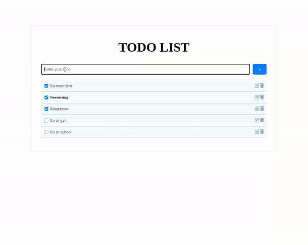

# MERN Todo App

This is a simple Todo application built using the MERN stack (MongoDB, Express.js, React.js, Node.js).

## Features

- Create, read, update, and delete todos
- Backend API with standardized responses
- Frontend built with React

## Prerequisites

Before you begin, ensure you have met the following requirements:

- Node.js and npm installed on your machine
- MongoDB installed or access to a MongoDB Atlas account

## Installation

### Backend

1. **Clone the repository:**

    ```bash
    git clone https://github.com/KoklimOu/MERN-Todo-App.git
    cd MERN-Todo-App/backend
    ```

2. **Install backend dependencies:**

    ```bash
    npm install
    ```

3. **Create a `.env` file in the `backend` directory and add your MongoDB URI:**

    ```plaintext
    DATABASE_URI="your_mongodb_uri_here"
    ```

4. **Start the backend server:**

    ```bash
    npm run dev
    ```

    The server will start on `http://localhost:5000`.

### Frontend

1. **Navigate to the frontend directory:**

    ```bash
    cd ../frontend/todo-app
    ```

2. **Install frontend dependencies:**

    ```bash
    npm install
    ```

3. **Start the frontend development server:**

    ```bash
    npm run dev
    ```

    The frontend server will start on `http://localhost:3000`.

4. **Configure API URL:**

    Update the API URL in the frontend application configuration file. Navigate to `src/services/config.js` and replace the `API_URL` with the appropriate backend API URL.

## Backend API Routes

- **GET /api/todos**: Retrieve all todos.
- **POST /api/todos**: Create a new todo.
- **PUT /api/todos/:id**: Update an existing todo.
- **DELETE /api/todos/:id**: Delete a todo by ID.

## Usage

- Open your browser and navigate to `http://localhost:3000` to view the application.
- Use the interface to create, read, update, and delete todos.



## Contact

If you have any questions or feedback, feel free to contact me at oukoklim@gmail.com.
